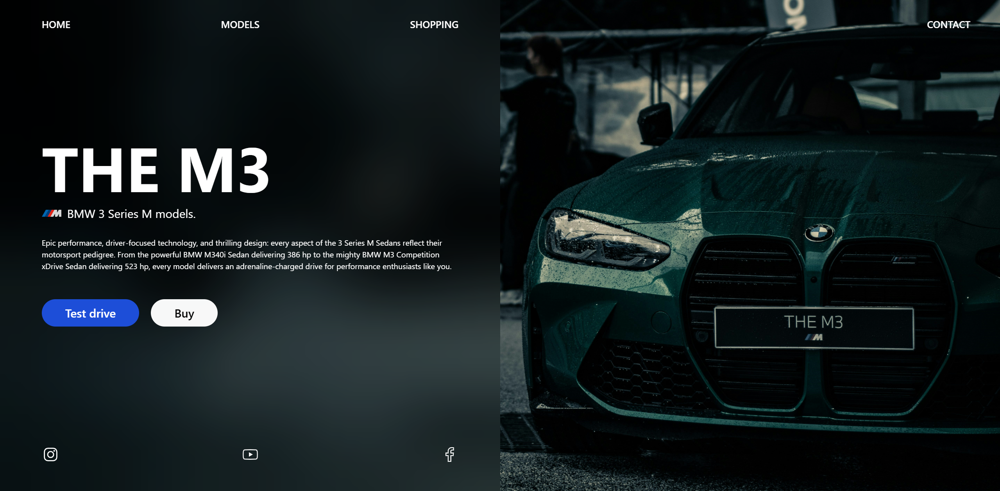
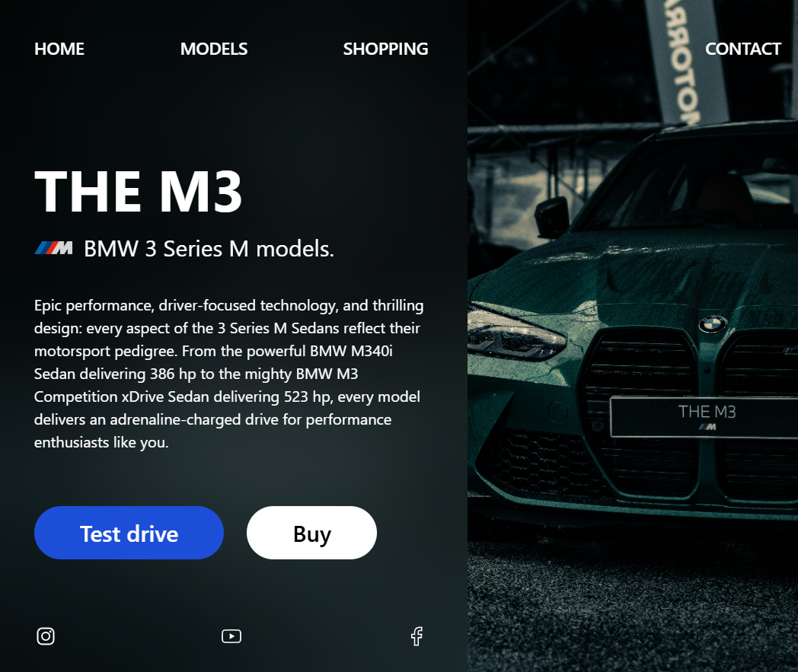
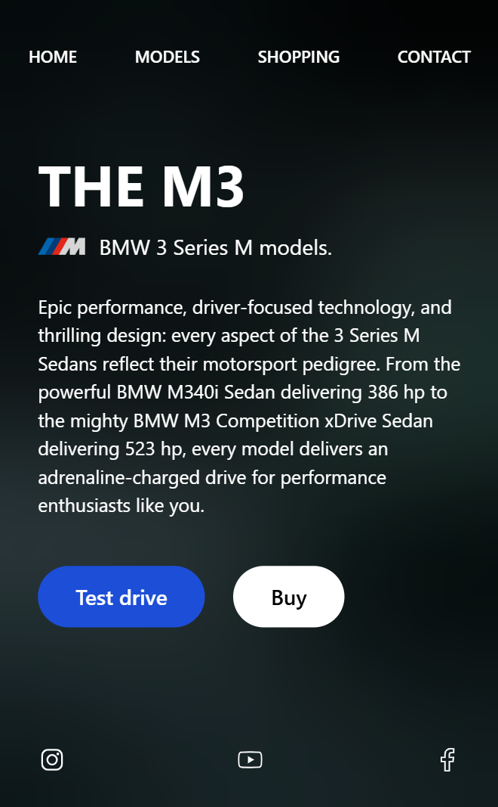

### [Live preview](https://alak6ar.github.io/bmw-m3-landing-page/)

# BMW M3 Landing Page

A sleek and responsive landing page for the **BMW M3**, built with **HTML, CSS, and Tailwind CSS**. This template showcases a modern UI with a split-screen design, featuring a bold introduction on the left and an eye-catching image of the BMW M3 on the right.

## ✨ Features

- **Fully Responsive** – Adapts to different screen sizes
- **Modern Design** – Clean UI with a luxury feel
- **Tailwind CSS** – Lightweight and highly customizable
- **Call-to-Action Buttons** – "Test Drive" and "Buy" buttons for user interaction
- **Navigation Bar** – Includes Home, Models, Shopping, and Contact links
- **Social Media Icons** – Instagram, YouTube, and Facebook integration

## 🚀 Technologies Used

- **HTML5**
- **CSS3**
- **Tailwind CSS**

## 📸 Screenshot





## 📦 Installation & Usage

1. Clone this repository:
   ```bash
   git clone https://github.com/Alak6ar/bmw-m3-landing-page.git
   ```
2. Open `index.html` in your browser.
3. Customize as needed!

## 🛠 Customization

- Update the car image in `/assets/images/`
- Adjust content in `index.html`

## 📜 License

This project is **open-source** and available under the MIT License.